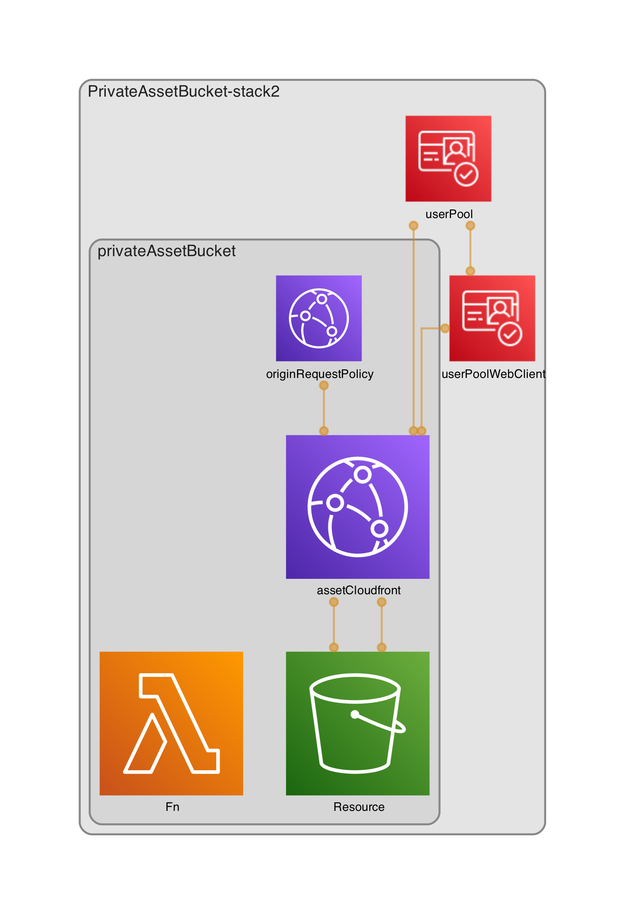

[](https://badge.fury.io/js/cdk-private-asset-bucket)
[](https://badge.fury.io/py/cdk-private-asset-bucket)
[](https://www.nuget.org/packages/com.github.mmuller88.cdkPrivateAssetBucket/)


# cdk-private-asset-bucket

A construct to create a private asset S3 bucket. Cognito will be used for token validation with Lambda@Edge.

## Architecture



Curious how I did the diagram? Have a look here https://martinmueller.dev/cdk-dia-eng .

# Example

```ts
    import { PrivateAssetBucket } from 'cdk-private-assets-bucket';
    ...
    const userPool = new cognito.UserPool(stack, 'userPool', {
      removalPolicy: core.RemovalPolicy.DESTROY,
    });

    const userPoolWebClient = new cognito.UserPoolClient(stack, 'userPoolWebClient', {
      userPool: userPool,
      generateSecret: false,
      preventUserExistenceErrors: true,
      authFlows: {
        adminUserPassword: true,
        userPassword: true,
      },
      oAuth: {
        flows: {
          authorizationCodeGrant: false,
          implicitCodeGrant: true,
        },
      },
    });

    const privateAssetBucket = new PrivateAssetBucket(stack, 'privateAssetBucket', {
      userPoolId: userPool.userPoolId,
      userPoolClientId: userPoolWebClient.userPoolClientId,
      tokenUse: 'access',
    });

    new core.CfnOutput(stack, 'AssetBucketName', {
      value: privateAssetBucket.assetBucketName,
    });

    new core.CfnOutput(stack, 'AssetBucketCloudfrontUrl', {
      value: privateAssetBucket.assetBucketCloudfrontUrl,
    });
```

## Properties

[API.md](API.md)

## Test PrivateBucketAsset

If you forged / cloned that repo you can test directly from here. Don't forget to init with:

```bash
yarn install
```

Create a test cdk stack with one of the following:

```bash
yarn cdk deploy
yarn cdk deploy --watch
yarn cdk deploy --require-approval never
```

- Upload a picture named like pic.png to the private asset bucket
- Create a user pool user and get / save the token:

```bash
USER_POOL_ID=us-east-1_0Aw1oPvD6
CLIENT_ID=3eqcgvghjbv4d5rv32hopmadu8
USER_NAME=martindev
USER_PASSWORD=M@rtindev1
REGION=us-east-1
CFD=d1f2bfdek3mzi7.cloudfront.net

aws cognito-idp admin-create-user --user-pool-id $USER_POOL_ID --username $USER_NAME --region $REGION
aws cognito-idp admin-set-user-password --user-pool-id $USER_POOL_ID --username $USER_NAME --password $USER_PASSWORD  --permanent --region $REGION
ACCESS_TOKEN=$(aws cognito-idp initiate-auth --auth-flow USER_PASSWORD_AUTH --client-id $CLIENT_ID --auth-parameters USERNAME=$USER_NAME,PASSWORD=$USER_PASSWORD  --region $REGION | jq -r '.AuthenticationResult.AccessToken')

echo "curl --location --request GET "https://$CFD/pic.png" --cookie "Cookie: token=$ACCESS_TOKEN""
```

- You can use the curl for importing in Postman. but it looks like Postman can't import the cookie. So you need to set the cookie manually in Postman!
- In Postman you should see your picture :)
- For Debugging the Lambda@Edge with Cloudwatch go to the AWS Console --> Cloudwatch --> Log groups --> switch to the region you are closest to --> figure out which log group is correct

## Planned Features

- Support custom authorizer
- Leverage Cloudfront Function for cheaper costs

## Misc

- There is currently my aws-cdk PR open for importing the Typescript Lambda@Edge interface https://github.com/aws/aws-cdk/pull/18836

## Thanks To

- Crespo Wang for his pioneer work regarding private S3 assets https://javascript.plainenglish.io/use-lambda-edge-jwt-to-secure-s3-bucket-dcca6eec4d7e
- As always to the amazing CDK / Projen Community. Join us on [Slack](https://cdk-dev.slack.com)!
- [Projen](https://github.com/projen/projen) project and the community around it
- To you for checking this out. Check me out and perhaps give me feedback https://martinmueller.dev .

I love to work on Content Management Open Source projects. A lot from my stuff you can already use on https://github.com/mmuller88 . If you like my work there and my blog posts, please consider supporting me on Patreon:

<a href='https://patreon.com/bePatron?u=29010217' target='_blank'></a>

<a href='https://ko-fi.com/T6T1BR59W' target='_blank'></a>